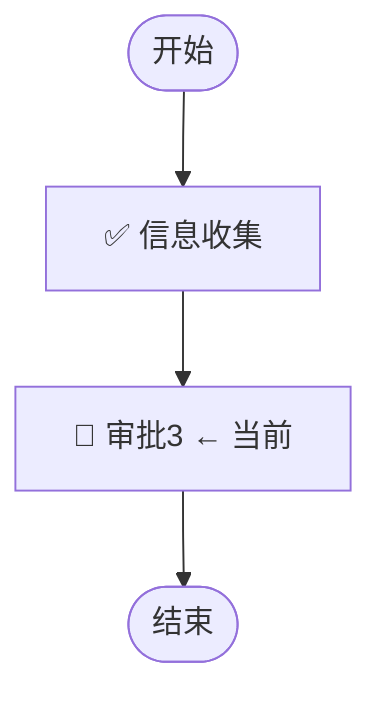

# 展示模板：流程单详情（instance-detail）

## 用途
整合 `DescribeWorkflowInstance` + `GetInstanceTaskList` + `ExportWorkflowInstanceList` 的返回数据，先呈现全局视图再聚焦进行中任务，最后展示字段实际填写值。

---

## 输出格式

````markdown
## 📄 流程单详情：{Title}

### 📄 基本信息

| 字段 | 值 |
|------|----|
| 流程单ID | `{Id}` |
| 整体状态 | {Status_Emoji} |
| 发起人 | {Creator} |
| 发起时间 | {CreateTime} |
| 总耗时 | {CostTime格式化} |
| 所属流程 | {WorkflowName}（{WorkflowId}） |
| 管理员 | {Managers} |

---

### 🔀 流程进度图



> ✅ = 已完成 | 🔄 = 进行中（当前停留） | ⏳ = 待激活

---

### 📋 任务节点概览

| # | 节点名称 | 类型 | 状态 | 处理人 | 耗时 |
|---|---------|------|------|--------|------|
| 1 | 信息收集 | 📋 收集 | ✅ 已完成 | ritarqwang | 9秒 |
| 2 | **审批3** | 🔵 审批 | **🔄 进行中** | **ritarqwang, jamesye** | **8天22小时** |

---

### ⚡ 进行中的任务

**{TaskName}** · {TaskType_Emoji} · 🔄 进行中

| 字段 | 值 |
|------|----|
| 节点开始时间 | {TaskCreateTime} |
| 已停留 | ⏱️ {格式化时长} |
| 当前处理人 | {HandleList[].Handler，逗号分隔} |
| 审批方式 | {or=或签 / and=会签} |

{如有多个进行中节点，逐个展示}

---

### 📋 输入字段值：{Title}（{Id}）

| 字段名 | 值 |
|-------|----|
| {字段Name} | {字段值} |

> 字段值通过 `ExportWorkflowInstanceList` 查询，展示用户实际填写的内容。
> 枚举类型展示 Label，空值展示 `—`，数组值用逗号分隔。

---

> 以上数据均来自流程平台（https://huijin.woa.com/flow/apply/detail/{InstanceId}）
````

---

## 已结束的流程单

当流程单已结束（无进行中任务）时，流程图节点全部标 ✅，第三部分「⚡ 进行中的任务」替换为：

```markdown
### ⚡ 任务状态

✅ 所有任务已完成，流程已于 {EndTime} 结束，总耗时 {CostTime格式化}。
```

## 已撤单/已驳回

流程图中终止节点标 ❌，第三部分替换为：

```markdown
### ⚡ 任务状态

{↩️ 已撤单 / ❌ 已驳回}

| 字段 | 值 |
|------|----|
| 终止原因 | {撤单/驳回} |
| 最后处理节点 | {最后一个有 DealHistory 的节点名} |
| 处理人 | {Handler} |
| 审批意见 | {Opinion 或 "（无意见）"} |
| 终止时间 | {EndTime} |
```

---

## Mermaid 流程图规则

| 节点状态 | Mermaid 标注 |
|---------|-------------|
| 已完成 | `[✅ {NodeName}]` |
| 进行中 | `[🔄 {NodeName} ← 当前]` |
| 待激活 | `[⏳ {NodeName}]` |
| 已驳回终止 | `[❌ {NodeName}]` |

**连线关系**：从 `SeqFlowList` 解析 SourceRef → TargetRef 绘制连线。

**简化规则**：如果节点 ≤ 5 个且无分支，也可用文字箭头：
```
开始 → ✅信息收集 → 🔄审批3(当前) → ⏳结束
```

---

## 时间格式化规则

| 耗时范围 | 展示格式 |
|---------|---------|
| < 60 秒 | `{n}秒` |
| < 60 分钟 | `{n}分钟` |
| < 24 小时 | `{n}小时{m}分钟` |
| ≥ 24 小时 | `{n}天{m}小时` |

---

## 数据来源声明

```markdown
> 以上数据均来自流程平台（https://huijin.woa.com/flow/apply/detail/{InstanceId}）
```

---

## 示例输出

```markdown
## 📄 流程单详情：【企业实名状态异常提醒】ritarqwang

### 📄 基本信息

| 字段 | 值 |
|------|----|
| 流程单ID | `T2026052500004163` |
| 整体状态 | 🔄 进行中 |
| 发起人 | ritarqwang |
| 发起时间 | 2026-05-25 11:38:00 |
| 总耗时 | 8天23小时 |
| 所属流程 | 企业实名状态异常提醒（P2025122400000848） |
| 管理员 | ritarqwang, v_yalozhang |

---

### 🔀 流程进度图

开始 → ✅ 信息收集 → **🔄 审批3（当前）** → ⏳ 结束

---

### 📋 任务节点概览

| # | 节点名称 | 类型 | 状态 | 处理人 | 耗时 |
|---|---------|------|------|--------|------|
| 1 | 信息收集 | 📋 收集 | ✅ 已完成 | ritarqwang | 9秒 |
| 2 | **审批3** | 🔵 审批 | **🔄 进行中** | **ritarqwang, jamesye** | **8天22小时** |

---

### ⚡ 进行中的任务

**审批3** · 🔵 审批节点 · 🔄 进行中

| 字段 | 值 |
|------|----|
| 节点开始时间 | 2026-05-25 11:38:13 |
| 已停留 | ⏱️ 8天22小时58分钟 |
| 当前处理人 | ritarqwang, jamesye |
| 审批方式 | 或签（任一人审批即可） |

---

### 📋 输入字段值：【企业实名状态异常提醒】ritarqwang（T2026052500004163）

| 字段名 | 值 |
|-------|----|
| 产品名称 | 12312 |
| 产品类目 | 数码电子 |
| 品牌名称 | 123 |
| 计划上架日期 | 2026-06-22 |
| RadioGroup | 选项 1 |
| 产品描述 | 12 |
| 产品图片 | — |
| 资质文件 | 白名单Uin1777432221004.csv |
| 申请备注 | 12312 |

> 以上数据均来自流程平台（https://huijin.woa.com/flow/apply/detail/T2026052500004163）
```
