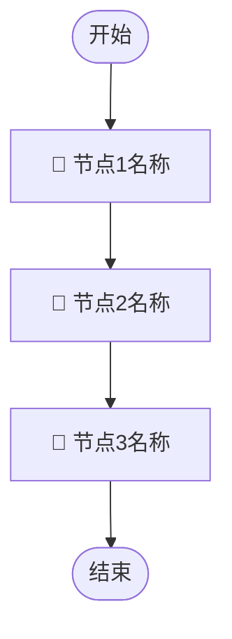
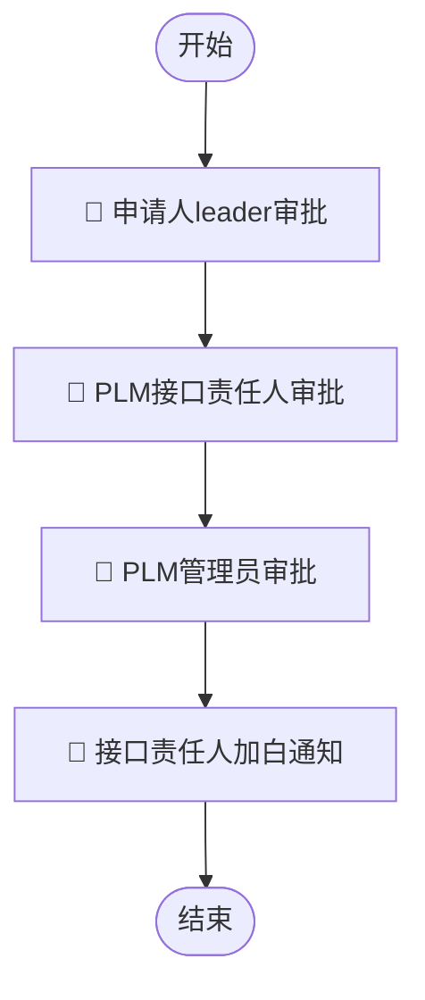

# 展示模板：流程画布详情（workflow-detail）

## 用途
渲染 `DescribeWorkflow` 接口返回的流程画布详情数据，用 Markdown 有条理地描述整个流程框架。

---

## 输出格式

````markdown
## 📋 流程详情：{Name}

### 概览

| 字段 | 值 |
|------|----|
| 流程ID | `{Id}` |
| 状态 | {Status_Emoji} |
| 版本 | v{PublishVersion} |
| 创建人 | {Creator} |
| 更新时间 | {UpdateTime} |

**描述**：{Description 或 "暂无描述"}

---

### 🔀 流程框架

{根据节点数量选择展示方式}

**方式一：Mermaid 流程图（节点 ≥ 3 个时使用）**



**方式二：文字描述（节点 ≤ 2 个或 Mermaid 不可用时）**

> 开始 → 节点1名称（🔵审批）→ 节点2名称（📢通知）→ 结束

共 {N} 个节点（{审批数}个审批 + {通知数}个通知 + {执行数}个执行）

---

### 📝 输入参数（共 {InputParams.length} 项）

发起该流程时需要填写以下参数：

| 序号 | 字段名称 | 参数键 | 类型 | 必填 | 输入方式 |
|------|---------|--------|------|------|---------|
| 1 | {Name} | {Key} | {Type} | {★/○} | {展示类型说明} |

{如有枚举字段，追加可选值说明}

---

### 👥 管理员

{Managers, 逗号分隔}

> 以上数据均来自流程平台（https://huijin.woa.com/flow）
````

---

## 状态 Emoji 映射

| Status 值 | 展示 |
|-----------|------|
| `Enable` | ✅ 已启用 |
| `Draft` | 📝 未发布 |
| `Ready` | 🔧 待发布 |
| `Disable` | ⛔ 已停用 |

## 必填标记规则

| Optional 值 | 展示 |
|-------------|------|
| `false` | ★ 必填 |
| `true` | ○ 可选 |

## 输入方式映射

| DisplayType 值 | 展示说明 |
|----------------|---------|
| `enum` | 下拉选择（枚举） |
| `rtx` | 人员选择（RTX） |
| 空字符串 | 文本输入 |

## 枚举值处理

当 `DisplayType = "enum"` 且 `Display.Enum` 有值时，在参数表后追加：

```markdown
**「{字段名称}」可选值**：
- {Label1}（`{Value1}`）
- {Label2}（`{Value2}`）
- ...（超过 5 项则折叠，显示「等共 N 项」）
```

---

## Mermaid 流程图节点命名规则

| 节点类型 | 图形 | 前缀 |
|---------|------|------|
| 开始/结束 | `([文字])` 圆角 | — |
| 审批节点 | `[🔵 文字]` 方框 | 🔵 |
| 通知节点 | `[📢 文字]` 方框 | 📢 |
| 执行节点 | `[⚙️ 文字]` 方框 | ⚙️ |
| 条件分支 | `{条件描述}` 菱形 | — |

---

## 数据来源声明

```markdown
> 以上数据均来自流程平台（https://huijin.woa.com/flow）
```

---

## 示例输出

````markdown
## 📋 流程详情：PLM云API加白申请

### 概览

| 字段 | 值 |
|------|----|
| 流程ID | `P2026051400000274` |
| 状态 | ✅ 已启用 |
| 版本 | v8 |
| 创建人 | jamesye |
| 更新时间 | 2026-05-14 16:00:00 |

**描述**：PLM云API访问白名单申请流程，用于申请特定 API 的调用权限。

---

### 🔀 流程框架



共 4 个节点（3 个审批 + 1 个通知）

---

### 📝 输入参数（共 4 项）

发起该流程时需要填写以下参数：

| 序号 | 字段名称 | 参数键 | 类型 | 必填 | 输入方式 |
|------|---------|--------|------|------|---------|
| 1 | API 名称 | Action | string | ★ | 下拉选择（枚举） |
| 2 | 平台主账号 | Uin | string | ★ | 文本输入 |
| 3 | 平台子账号 | SubUIn | string | ★ | 文本输入 |
| 4 | 申请原因 | Reason | string | ★ | 文本输入 |

**「API 名称」可选值**：
- 修改或新增流程单关注人（`UpdateInstanceFollowers`）
- 通过标签tag查询规则列表（`GetRuleListByTag`）
- 获取规则详情（`GetRuleDetail`）
- ...等共 12 项

---

### 👥 管理员

jamesye

> 以上数据均来自流程平台（https://huijin.woa.com/flow）
````
