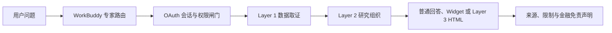

# 同舟股市投研专家 WorkBuddy 一期测试需求

## 1. 文档信息

| 项目 | 内容 |
|---|---|
| 测试对象 | WorkBuddy 官方专家「同舟股市投研专家」 |
| 源码基线 | 专家包 `0.12.1`；正式测试时以商店实际安装版本为准 |
| 一期目标 | 验证用户问题能经过认证闸门，路由到正确研究能力，调用受控数据源，并生成有证据、可降级、合规的结果 |
| 主要读者 | 产品、测试、研发、运营 |
| 不包含 | 压测、1000 活跃请求验收、私人持仓分析、自动定时跟踪、候选 Playbook 全量测试 |

本文档描述“要测什么”和“什么算通过”。具体环境、用例、工具轨迹和缺陷取证方法见 `docs/workbuddy-phase1-test-technical-guide.md`。

## 2. 背景与产品边界

同舟股市投研专家不是单一问答 Prompt，而是由以下能力共同组成：

| 层级 | 数量 | 职责 | 用户是否直接感知 |
|---|---:|---|---|
| 认证与连接 | 1 | 建立 OAuth 会话、检查授权、通过受控 MCP Gateway 调用数据能力 | 只感知网页授权、错误恢复和服务状态 |
| Layer 1 数据合同 | 4 | 规范行情、文档、行业图谱、同舟内容的查询方式和来源边界 | 不应看到内部 Skill、Server、Tool 名称 |
| Layer 2 研究模块 | 11 | 组织个股、行业、公告、政策、研报、证据、传导链、反方审查、可视化和 HTML 渲染 | 感知为自然的研究任务 |
| Layer 3 完整场景 | 2 | 组合多个研究模块完成行业多空风向标和事件因子解读 | 感知为完整报告或 HTML 页面 |

一期测试关注完整主链路：

Skill 是 Agent 的指令与工作流合同，不等同于可被测试工具直接监听的后端函数。因此，一期必须综合以下证据判断路由是否正确：

1. WorkBuddy 执行详情中可见的 Skill 或工具轨迹。
2. Gateway 侧记录的 Server、Tool、状态码和耗时。
3. 最终结果是否满足目标 Skill 的输出合同。

仅凭回答中出现了某个关键词，不能证明对应 Skill 已正确执行。

## 3. 一期测试目标

1. 验证首次授权、已授权、会话失效、权限不足、限流和上游故障均有正确处理。
2. 验证典型用户问法能稳定进入预期的 Layer 2 或 Layer 3 研究路径。
3. 验证依赖多个数据源时，先解析公司或行业身份，再调用下游数据，不混用不同 ID 体系。
4. 验证近期事实、数字、公告、研报和观点均来自本轮已认证证据。
5. 验证数据缺失、样本不足和部分数据源不可用时能够诚实降级，不补示例数字或假链接。
6. 验证 K 线、趋势、事件收益和研报图片等可视化能够正常展示，失败时能回退到文字或表格。
7. 验证结果不泄露 API Key、手机号、内部 ID、原始 JSON、数据库结构和调试过程。
8. 验证金融类结果始终保留四要素免责声明。

## 4. 用户角色与前置条件

| 角色/状态 | 用途 |
|---|---|
| 未授权用户 | 验证首次调用触发 WorkBuddy Connector OAuth 授权，而不是直接编造回答 |
| 正常授权用户 | 验证四个数据源和完整研究主链路 |
| 会话失效或已撤销授权用户 | 验证认证失败后立即停止且不复用旧证据 |
| 部分授权用户 | 验证无权限 Server/Tool 的边界和降级说明 |
| 达到配额用户 | 验证 `429`、等待提示和恢复入口 |
| 测试运营人员 | 在 Gateway 监控中核对调用轨迹、使用量和异常 |

测试账号、OAuth token、API Key 和手机号均属于敏感信息。截图、缺陷单和测试报告只能展示脱敏值。

## 5. 一期范围

### 5.1 P0 主链路

以下路径必须全部通过：

| 编号 | 用户场景 | 预期主路由 | 关键数据依赖 | 主要结果 |
|---|---|---|---|---|
| P0-01 | 首次使用、尚未授权 | 认证与连接 | WorkBuddy Connector OAuth | 打开网页授权，授权前停止业务回答 |
| P0-02 | 完成 WorkBuddy 网页授权后重试 | 原问题对应路由 | 已授权 Connector | 同一次用户任务可继续，不再被本地凭证检查误拦截 |
| P0-03 | 点名股票或上市公司 | `layer2-stock-brief` | 行情、公司新闻、公告/研报 | 身份、近期表现、事件、观点和风险 |
| P0-04 | 个股叙事、估值隐含预期或涨跌逻辑 | `layer2-stock-narrative-valuation` | 个股简报、研报、估值证据 | 叙事阶段、估值锚、支持与证伪证据 |
| P0-05 | 某条公告或财报解读 | `layer2-announcement-brief` | 公告正文、公司和行情背景 | 公告事实、关键数字、影响变量 |
| P0-06 | 行业近况、景气、估值或政策影响 | `layer2-industry-brief` | 行业身份、行情、文档、图谱、同舟观点 | 口径明确的行业简报和证据缺口 |
| P0-07 | 研报、机构观点或分歧 | `layer2-research-digest` | 公司身份、研报、同舟观点 | 样本范围、共识、分歧和关键假设 |
| P0-08 | 政策、监管、会议或官方事件 | `layer2-policy-event-brief` | 新闻/公告、行情、图谱、同舟观点 | 政策事实、影响路径和待验证变量 |
| P0-09 | 已取证材料的证据审计 | `layer2-evidence-ledger` | 当前任务已取得的证据 | 支持、反对、冲突和待验证项 |
| P0-10 | 事件到产业链上下游的影响路径 | `layer2-transmission-chain-builder` | 已取证事件、行业和图谱 | 事件、机制、产业链位置和验证指标 |
| P0-11 | 对既有结论做反方审查 | `layer2-research-red-team` | 已取证底稿或证据台账 | 关键假设、反对证据和证伪信号 |
| P0-12 | K 线、趋势或事件收益图 | `layer2-research-visuals` | 已认证结构化证据、WorkBuddy Widget | 一张可读图和文字结论；失败时表格降级 |
| P0-13 | 行业多空风向标 HTML | `layer3-industry-windvane` | 四类 Layer 1 数据和多个 Layer 2 模块 | 单文件 HTML、六维因子、情景矩阵、源头复核 |
| P0-14 | 事件因子解读 HTML | `layer3-event-interpretation` | 事件证据、传导链、历史样本、反方审查 | 首屏事件标题与链接、因子、样本和证伪项 |

### 5.2 P1 异常与降级

| 编号 | 场景 | 预期行为 |
|---|---|---|
| P1-01 | OAuth 会话失效、授权撤销或账号禁用 | 停止业务取证，不回显 token，提示重新授权或检查状态 |
| P1-02 | Server 或 Tool 权限不足 | 明确当前能力未授权，不把 `403` 写成“没有数据” |
| P1-03 | 分钟或日配额达到上限 | 说明限流并遵循恢复时间，不持续重试 |
| P1-04 | Gateway 或上游能力不可用 | 说明能力暂不可用，不编造结果，不误判为 OAuth 失效 |
| P1-05 | 行业名称存在多个候选 | 展示可理解的候选并请用户确认，或说明本轮未稳定匹配 |
| P1-06 | 研报查询参数过宽或缺少公司范围 | 收窄参数后最多重试一次，不直接宣称“没有研报” |
| P1-07 | 某个来源无结果 | 保留已有来源并标注缺口，不让单一来源失败拖垮全部回答 |
| P1-08 | 历史相似事件样本不足 | 标注样本不足，不生成示例统计，不外推未来收益 |
| P1-09 | 60 日等长期窗口无有效样本 | 从期限拆解、综合判断和情景矩阵中跳过，只在数据口径说明 |
| P1-10 | 数据只有来源类型、没有文章级链接 | 展示来源类型，不生成假链接 |
| P1-11 | WorkBuddy 不支持 Widget 或 Widget 校验失败 | 最多修正一次，随后回退为表格或文字 |
| P1-12 | 无状态 MCP 响应不返回 Session ID | 仍可完成初始化和工具调用，不报“缺少 session ID” |
| P1-13 | WorkBuddy 长任务出现 `aborted` / `4002` | 保留执行详情和完成时间，区分客户端中止、模型任务和后端调用状态 |
| P1-14 | 用户询问加群、反馈或使用帮助 | 只在用户明确提出时生成短时服务入口；失败时给控制台入口 |

## 6. 功能要求

### FR-01 认证必须先于业务取证

- 本轮没有成功的 WorkBuddy Connector 业务调用时，不得生成近期金融事实；首个业务调用同时承担认证检查。
- WorkBuddy 已成功完成 OAuth 授权后，重试原问题应直接使用 Connector 会话，不能再运行 Shell、npm、Node、本地配置或 API Key 预检。
- 认证失败后不得继续使用上一轮、缓存或模型记忆中的数据。
- 不得通过全局或临时 MCP 工具绕过受控 Gateway。

### FR-02 路由必须匹配用户意图

- 点名股票、行业、公告、研报、政策、证据审计、产业链、反方审查、可视化和两个 HTML 场景应进入各自预期路径。
- 市场热点、盘面复盘等宽泛问题应先收窄到行业、政策或研报路径，不生成无边界的泛市场日报。
- 用户可见结果使用业务语言，不暴露 `layer1-*`、`layer2-*`、`layer3-*` 等内部路由名。

### FR-03 身份解析必须先行

- 公司、股票、行业、主题、板块和产业链图谱在下游调用前必须先解析稳定身份。
- Same Boat `sector_id`、Fin Data `basket_id`、申万代码、市场指数代码、图谱主题和产业链 `frame_id` 不得互相代用。
- 没有稳定映射时应说明匹配缺口或让用户确认候选，不猜 ID。

### FR-04 证据必须来自本轮调用

- “最新、今日、近期、公告、研报、政策影响、行业异动”等内容必须有本轮检索或结构化数据证据。
- 数字必须保留日期、时间窗口、单位和来源类型。
- 公告、研报和新闻优先保留标题、发布日期、来源及可用的文章级链接。
- 多来源冲突时保留来源边界，不合并成单一确定结论。

### FR-05 调用必须受预算和重试约束

- 常规文字问答最多 8 次业务工具调用。
- 用户明确要求 HTML 或深度报告时最多 14 次业务工具调用。
- 同一工具、同一参数的失败重试最多 1 次。
- 身份解析完成后，每批最多并发 3 个彼此独立的调用。
- 达到预算后用已有证据收口，不为了填模板继续检索。

### FR-06 可视化必须使用 WorkBuddy Widget 合同

- 普通问答可视化每轮最多调用一次 `read_me` 和一次 `show_widget`。
- 可视化只表达已经取到的证据，不能通过绘图步骤新增业务事实。
- 不得使用 Bash、Write、Python、临时脚本或临时文件生成图表。
- 图表失败时必须保留文字或表格结论。

### FR-07 Layer 3 页面必须满足审核合同

行业多空风向标必须：

- 动态解析用户输入行业，不写死行业编号或样例参数。
- 展示有效期限证据、六维因子、情景矩阵、新闻情绪和源头复核。
- 中国市场颜色习惯为上涨或正向红色、下跌或负向绿色。
- 统计样本不足时明确标注，不用宽基指数或示例数字替代。
- 输出单文件 HTML，不加载外部脚本、CSS、图片或字体，并按 PC 宽度验收。

事件因子解读必须：

- 首屏开头展示事件标题和可用的源头链接。
- 展示客观因子、影响链、业务暴露、历史相似事件和证伪项。
- 历史统计只展示真实有效样本；样本不足时明确说明。
- 输出单文件 HTML，不加载外部资源，并按 PC 宽度验收。

### FR-08 输出必须可理解且不暴露内部过程

- 最终结果使用中文，区分事实、解释、可能影响和待验证项。
- 不向用户展示工具参数、raw JSON、内部 ID、重试日志、Session ID 或调试过程。
- 不输出 “Let me...”、shell 报错、临时脚本说明或只包含计划的半成品回复。
- 无证据时直接说明认证或能力暂不可用。

### FR-09 金融安全边界必须稳定

- 每个金融类用户可见结果包含：本内容由 AI 生成、仅基于公开信息整理、不构成投资建议、不构成个股推荐。
- 不读取、推断或要求个人持仓、仓位、交易历史和账户信息。
- 不给出个性化买卖建议、仓位建议、收益承诺或确定性目标价。
- 用户询问“该不该买/卖”时转为公开证据和风险因素。

### FR-10 敏感信息不得泄露

- 不回显完整 API Key、短信验证码、完整手机号或客户身份信息。
- 不在截图、缺陷单、日志附件和 HTML 中保留敏感值。
- 不暴露物理数据库表、字段、SQL、索引、内部服务地址和隐藏研究备注。

## 7. Skill 能力清单

下表供测试选择覆盖面，不代表用户需要逐个手动选择 Skill。

| Skill | 层级 | 负责内容 | 一期覆盖 |
|---|---|---|---|
| `fin-mcp-gateway` | 连接 | 认证、授权、配额、故障恢复和受控 MCP 调用 | P0 |
| `layer1-doc-search` | L1 | 新闻、公告、事件、研报、纪要和文档详情 | P0 |
| `layer1-fin-data` | L1 | 行情、K 线、排行、成分、估值、宏观和财务指标 | P0 |
| `layer1-fin-graph` | L1 | 行业身份、行业图谱、产业链图谱、公开因子和异常 | P0 |
| `layer1-same-boat` | L1 | 同舟要闻、分析师、行业观点、异动归因和视觉证据 | P0 |
| `layer2-stock-brief` | L2 | 个股近期证据简报 | P0 |
| `layer2-stock-narrative-valuation` | L2 | 个股叙事、估值隐含预期、支持与证伪证据 | P0 |
| `layer2-announcement-brief` | L2 | 公告和财报解读 | P0 |
| `layer2-industry-brief` | L2 | 行业近况、景气、估值和政策影响 | P0 |
| `layer2-policy-event-brief` | L2 | 政策、监管、会议和官方事件 | P0 |
| `layer2-research-digest` | L2 | 研报摘要、共识、分歧和关键假设 | P0 |
| `layer2-evidence-ledger` | L2 | 证据台账和信源审计 | P0 |
| `layer2-transmission-chain-builder` | L2 | 事件到产业链的传导链路 | P0 |
| `layer2-research-red-team` | L2 | 反方审查、叙事漏洞和证伪信号 | P0 |
| `layer2-research-visuals` | L2 | K 线、趋势、事件收益和研报图片 | P0 |
| `layer2-html-research-playbook` | L2 | 已取证内容的共享 HTML 渲染 | 由两个 L3 间接覆盖 |
| `layer3-industry-windvane` | L3 | 行业多空风向标完整页面 | P0 |
| `layer3-event-interpretation` | L3 | 事件因子解读完整页面 | P0 |

## 8. 一期不在范围内

1. Gateway 或上游 MCP 的正式并发压测、容量验收和 1000 活跃请求目标。
2. 所有股票、行业、公告和研报数据的穷举准确性验证。
3. 自动创建 WorkBuddy 每日定时任务或持续跟踪任务。
4. 私人持仓、账户诊断、交易复盘、销售画像和客户适当性能力。
5. `playbooks/cases/` 中未随正式专家包发布的候选案例。
6. WorkBuddy 所有操作系统和所有客户端版本的完整兼容矩阵。
7. 商店包自动热更新；正式版本仍以 WorkBuddy 商店或审核包交付为准。

## 9. 验收标准

一期达到以下条件方可通过：

1. 所有 P0 用例通过，阻断级缺陷为 0。
2. P1 用例通过率不低于 95%，未通过项均有明确归属、规避方式和修复计划。
3. 认证失败关闭率为 100%，不存在失败后继续引用旧数据的情况。
4. 不存在伪造来源、伪造链接、伪造样本、示例数字冒充真实数据或跨 ID 体系误用。
5. 不存在 API Key、手机号、内部 ID、raw JSON、数据库结构或调试过程泄露。
6. 金融四要素免责声明覆盖率为 100%。
7. 可视化主路径可展示；客户端不支持或校验失败时，文字/表格降级成功率为 100%。
8. 两个 L3 页面均通过 PC 宽度、单文件、无外部资源、来源复核和数据缺口检查。

响应耗时、工具耗时、调用次数和异常数量在一期记录为基线指标，不作为容量验收结论。

## 10. 缺陷等级建议

| 等级 | 判定示例 |
|---|---|
| 阻断 | 无法登录/绑定、所有研究任务不可用、商店包无法加载、主要入口崩溃 |
| 严重 | 路由到错误业务、认证失败后继续回答、数据或链接伪造、敏感信息泄露、给出买卖建议 |
| 一般 | 单一数据源失败未正确降级、工具调用重复、日期/单位/来源遗漏、Widget 失败无表格兜底 |
| 轻微 | 文案、排版、标签、颜色、局部移动端或 PC 视觉问题，不影响结论和证据理解 |

## 11. 测试交付物

测试完成后至少保留：

1. 用例执行表及实际安装的专家版本、WorkBuddy 客户端版本、执行日期。
2. 每个失败用例的完整用户问法、执行详情截图、脱敏工具轨迹和最终输出。
3. Gateway 侧对应时间段的 Server、Tool、状态码、耗时和请求关联信息。
4. 两个 L3 HTML 原文件和 PC 宽度截图。
5. 阻断/严重缺陷清单、复测结果和剩余风险说明。
